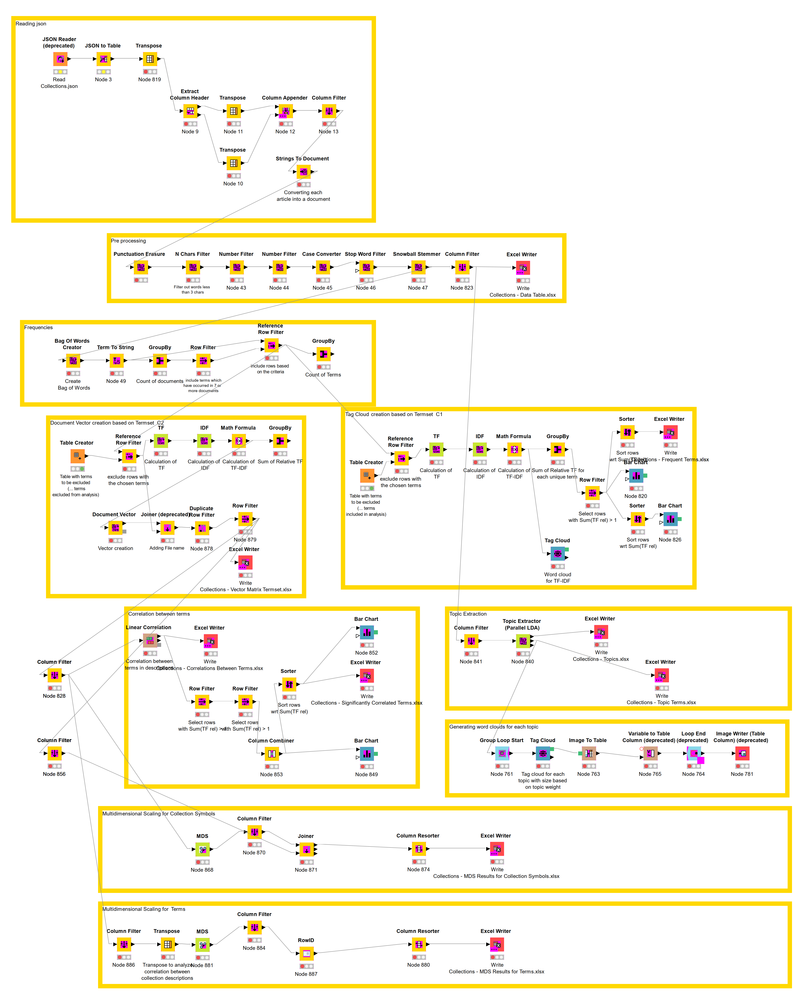

# EdenEngine
``EdenEngine`` is an analytics engine for MagicEden NFT Collection data, obtained through the [MagicEden API](https://api.magiceden.dev/#31fe6d3b-80eb-4d78-8582-3e66eeb45c25). The engine is implemented as a KNIME workflow. The current implementation of the engine focuses on the analysis of the text data in the ``description`` field of the data on Collections, which can be accessed through the [Collections API call](https://api-mainnet.magiceden.dev/v2/collections?offset=0&limit=500).

## Start Here:

- [**Documentation**](./doc/Documentation.md) describes the project and the EdenEngine analytics engine.
- [**YouTube Video**](https://youtu.be/...) is the demo video for the [MagicEden API Hackathon](https://api.magiceden.dev/#31fe6d3b-80eb-4d78-8582-3e66eeb45c25) hackathon.

## EdenEngine Team

- [Gurdal Ertek](https://github.com/gurdalertek) (System design, Algorithm design, Analytics modeling, System documentation)
- _Al Ain, United Arab Emirates_

<!--- Member of [BlockBlockData](https://blockblockdata.com) Team; Associate Professor of Business Analytics, [UAE University](https://cbe.uaeu.ac.ae/en/departments/analytics/) --->

## How to Use EdenEngine

**Step 1: Create Local Folder and Download Files**

- Download and paste all the files in the root folder of the ``EdenEngine`` github repository to ``C:\MagicEden``. 
- The folder name is important, as all the results files generated by the engine will be saved in this folder. 
- Also create a sub-folder under that folder, as ``C:\MagicEden\Topics``, to serve as the folder where the topic analysis word clouds will be saved.

**Step 2**: Access MagicEden API

- Double-click on ``MagicEden API Call for 500 Collections.URL`` shortlink, or enter into browser's URL address field the following: 
- [https://api-mainnet.magiceden.dev/v2/collections?offset=0&limit=500](https://api-mainnet.magiceden.dev/v2/collections?offset=0&limit=500).

**Step 3**: Query with MagicEden API

- If the number of collections to be analyzed is different than 500, change the last three digits accordingly (ex: change 500 to 150 for analyzing only 150 collections). 
- By default, MagicEden API allows retrieval of data for a maximum of 500 collections.
- Save the resulting page as a json file under ``C:\MagicEden``, with the default name of ``collections.json``

**Step 4**: Install KNIME

- If you do not currently have KNIME installed, download and install from [KNIME official website](https://knime.org).

**Step 5**: Query with MagicEden API

- Under ``C:\MagicEden``, double-click on the workflow file ``Collections - KNIME Analysis Engine.knwf``, which will open the workflow in KNIME. 

**Step 6**: Install Missing KNIME Extensions

- The EdenEngine workflow is using multiple KNIME extensions that are not installed as default with KNIME. 
- So, just follow the simple steps on the screen and install all the missing extensions.
- The progress of installation will be displayed on the lower right corner of KNIME.
- When the installation of extensions is finished, the EdenEngine analytics engine is ready to run.

**Step 7**: Run EdenEngine 

- In KNIME, click the green ``Execute all executable nodes (Shift+F7)`` play button on the ribbon to run the ``EgenEngine`` workflow.
- The default json file to be read is specified in the light-red ``JSON Reader`` node as `C:\MagicEden\collections.json```. Since you downloaded the file with the same name and moved to the default folder, to overwrite the old file, KNIME workflow should run smoothly.
- The running of EdenEngine may be stuck within the last module (bottom yellow frame), titled ``Multidimensional Scaling for Terms``. If this happens, double-click on the green ``MDS`` block, click Apply, save with ``Ctrl+S`` and then click the green play button again (alternatively, press on your keyboard ``Shirt+F7``).
- The module that consumes the most time is the ``Topic Extraction`` module (right side of the workflow) and the module that comes after that, titled ``Generating word clouds for each topic``. 
- The results are now generated. 
- Interactive plots are also generated within the worflow.

**Step 7**: Analyze the Results

- To analyze the results within KNIME, right-click on the dark blue nodes in the workflow, which are the ``Bar Chart`` and ``Tag Cloud`` nodes, and select ``Interactive View`` in the pop-up menu.
- To analyze the results within KNIME using Python, open the ``Node Repository`` and search for ``Python`` to use the Python-related KNIME nodes. You can also search for sample workflows under the [KNIME Hub](https://hub.knime.com/).
- To analyze the generated Excel files, open the Excel files in your favorite analytics suite, and analyze with the appropriate tools. The generated Excel files are ready for visual analytics.

## EdenEngine Screenshot




